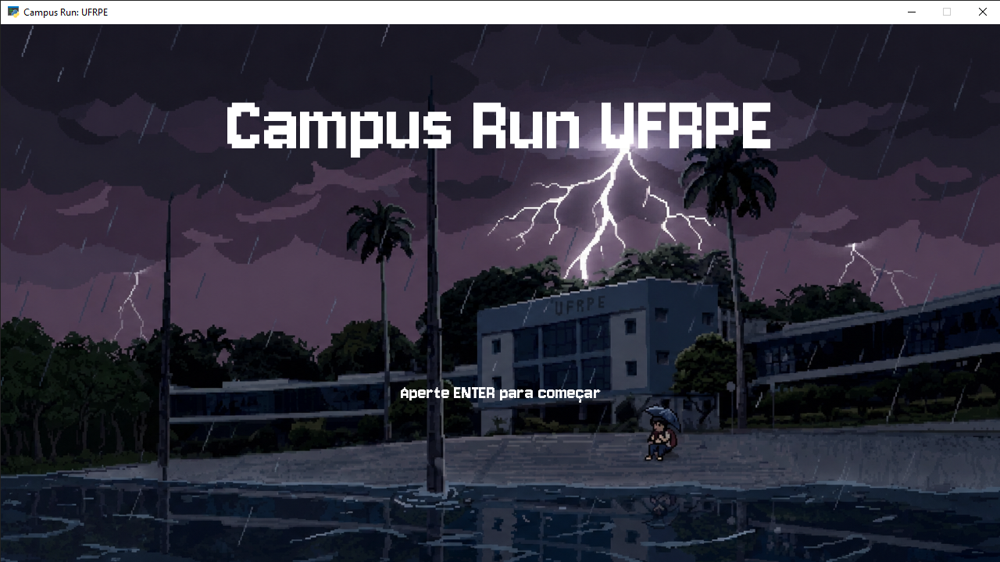
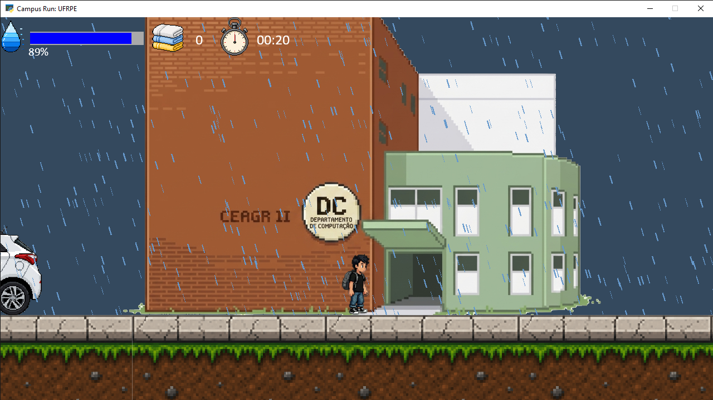
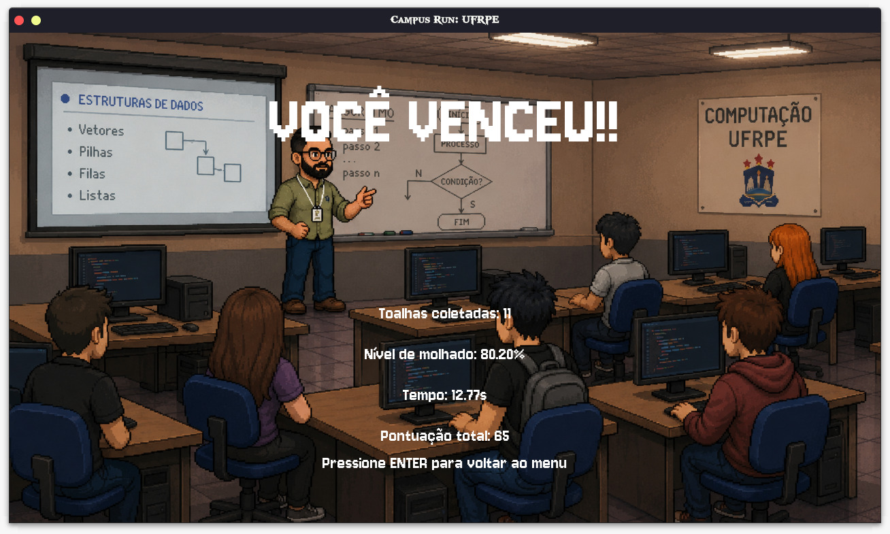

# 🎮 Campus Run UFRPE

> Projeto desenvolvido para a disciplina de **Projeto Interdisciplinar de Sistemas de Informação** da **Universidade Federal Rural de Pernambuco (UFRPE)**.

---

## 📖 Sobre o Jogo

**Campus Run UFRPE** é um jogo de plataforma 2D desenvolvido em Python utilizando a biblioteca Arcade.

No jogo, o jogador controla **Beto**, um estudante que precisa atravessar o campus da UFRPE em um dia chuvoso. Durante o percurso, ele deve evitar obstáculos, desviar de veículos e coletar toalhas espalhadas pelo cenário para reduzir seu nível de molhado.

O objetivo é chegar ao destino final no menor tempo possível, coletando o máximo de toalhas e mantendo o personagem o mais seco possível.

---

## 🗺️ Cenário

O mapa foi inspirado em locais reais da Universidade Federal Rural de Pernambuco, proporcionando uma experiência familiar para estudantes e visitantes do campus.

### Locais presentes no jogo

* 📍 Bar da Curva
* 📍 UFRPE (Sede Principal)
* 📍 DEINFO (Departamento de Estatística e Informática)
* 📍 CEAGRI II

---

## ⚙️ Tecnologias Utilizadas

* Python 3
* Arcade 3.x
* Pyglet
* Pillow
* Git
* GitHub

---

## 🚀 Como Executar o Projeto

### 1. Clonar o Repositório

```bash
git clone https://github.com/seu-usuario/Campus-Run-UFRPE.git
cd Campus-Run-UFRPE
```

### 2. Criar o Ambiente Virtual

```bash
python -m venv .venv
```

### 3. Ativar o Ambiente Virtual

#### Windows

```bash
.venv\Scripts\activate
```

#### Linux/macOS

```bash
source .venv/bin/activate
```

### 4. Instalar as Dependências

```bash
pip install -r requirements.txt
```

### 5. Executar o Jogo

```bash
python main.py
```

---

## 🎮 Controles

| Tecla  | Ação                  |
| ------ | --------------------- |
| ⬅️     | Mover para a esquerda |
| ➡️     | Mover para a direita  |
| Espaço | Pular                 |

---

## 🏆 Sistema de Pontuação

A pontuação final é calculada com base em três fatores:

| Critério           | Peso |
| ------------------ | ---- |
| Tempo de conclusão | 50%  |
| Nível de molhado   | 30%  |
| Toalhas coletadas  | 20%  |

Quanto menor o tempo e o nível de molhado, e quanto maior o número de toalhas coletadas, melhor será o desempenho do jogador.

---

## 📸 Capturas de Tela

### 🏠 Tela Inicial



Tela inicial do jogo, apresentando o personagem principal e o início da aventura pelo campus.

---

### 🏃 Gameplay



Durante a partida, o jogador percorre o campus enfrentando obstáculos e coletando toalhas para permanecer seco.

---

### 🏆 Tela de Vitória



Ao concluir o percurso com sucesso, o jogador recebe uma mensagem de vitória e sua avaliação final.

---

### ☔ Tela de Derrota


Caso o personagem fique completamente molhado antes de chegar ao destino, a partida é encerrada e a tela de derrota é exibida.

---

## 🎯 Objetivos do Projeto

Este projeto foi desenvolvido para aplicar conhecimentos de:

* Programação Orientada a Objetos (POO)
* Desenvolvimento de Jogos 2D
* Estruturas de Dados
* Manipulação de Eventos
* Desenvolvimento com Python
* Controle de Versão com Git
* Trabalho Colaborativo com GitHub

---

## 📂 Estrutura do Projeto

```text
Campus-Run-UFRPE/
│
├── assets/
├── inicio.png
├── tela.png
├── voce_venceu.png
├── voce_perdeu.png
├── main.py
├── requirements.txt
└── README.md
```

---

## 👥 Equipe

Projeto desenvolvido por estudantes do curso de **Sistemas de Informação — UFRPE**.

* José Alberto
* Tomás Kavela

---

## 🎓 Instituição

**Universidade Federal Rural de Pernambuco (UFRPE)**

Disciplina: Projeto Interdisciplinar de Sistemas de Informação

Ano: 2026

---

## 📄 Licença

Este projeto possui finalidade exclusivamente acadêmica e educacional, não sendo destinado a fins comerciais.
